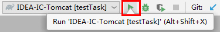
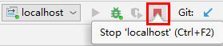
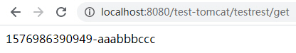

You can choose the runTomcat-en.gradle script which output English.

The most important parameters are as below:

- Configure the Environment variable TOMCAT_HOME_4IDEA

This environment variable is used to tell the Gradle script runTomcat.gradle what is the directory of the installed Tomcat. For example: C:\program\apache-tomcat-7.0.79 .

- Add the JVM argument appName

This argument is used to tell the Gradle script what is the name of current web application, it will use this argument to create a new Tomcat Instance.

By default, appName argument determines the context path of current web application.

- Add the JVM argument arg4Tomcat

When current Tomcat instance starts up, it will use arg4Tomcat argument as the JAVA_OPTS argument, i.e. the JVM argument used by current Tomcat instance.

- Example

```gradle
gradlew startTomcat -DappName=test-tomcat -Darg4Tomcat="-DtestValue=aaabbbccc -Dlog.home=E:\desktop\log-test"
```

I translate the following contents from Chinese to English by Google Translate.

```
table of Contents

1 Introduction
2. The method to try
    2.1. Smart Tomcat Plugin
Feasible method
    3.1. Description
    3.2. Dependent Environment
    3.3. Execute Gradle script in IDEA
        3.3.1. Execution in Terminal
        3.3.2. Execute in Run/Debug Configurations
            3.3.2.1. Solve the Chinese garbled problem when running Gradle script in Run/Debug Configurations
    3.4. Remote debugging in IDEA
        3.4.1. Create remote debugging configuration and get debugging parameters in IDEA
        3.4.2. Start debugged Java process after adding debug parameters
        3.4.3. Start debugging in IDEA
    3.5. How to use runTomcat.gradle script
        3.5.1. Task and parameter description
            3.5.1.1. Environment variables
            3.5.1.2. JVM parameters
        3.5.2. Environment Configuration
        3.5.3. Use scenarios
            3.5.3.1. Start the Tomcat process normally
            3.5.3.2. Use the Tomcat instance startup script to start the Tomcat process
            3.5.3.3. Stopping the Tomcat process
                3.5.3.3.1. Close the Tomcat window directly (the application instance cannot receive the web container destruction notification)
                3.5.3.3.2. Use the Tomcat instance stop script to stop the Tomcat process (the application instance can receive a web container destruction notification)
            3.5.3.4. Debug Web Application
                3.5.3.4.1. Debugging after process startup
                3.5.3.4.2. Debugging from process start (two operations)
                3.5.3.4.3. Start debugging from process start (one-click completion)
                3.5.3.4.4. Debugging Tomcat classes
    3.6. Other notes
    3.7. Principles
        3.7.1. Generate files required for web applications
        3.7.2. Generate Tomcat instance
        3.7.3. Processing Tomcat context descriptor files
        3.7.4. Generate Tomcat instance start/stop script
        3.7.5. Starting Tomcat
        3.7.6. Debugging Web Applications
```

# 1 Introduction

IntelliJ IDEA Community Edition (community edition) does not support Tomcat. You don't want to spend money to buy the Ultimate version or use Eclipse. Try to make IDEA community edition support Tomcat through other methods.

# 2. Methods to try

## 2.1. Smart Tomcat Plugin

I installed the Smart Tomcat plug-in in the IDEA Community Edition (2019.2.4) and used it to start the Tomcat application. I encountered the following problems:

- The web application class file is not automatically copied to the corresponding web application root directory, resulting in the web application code not being loaded, which requires manual processing, which is inconvenient to use;
- The Tomcat log only generates the localhost_access_log.txt log file. Catalina.log, localhost.log and other log files are not generated, which is inconvenient for troubleshooting.

After encountering problems using the Smart Tomcat plug-in, I abandoned the use of the plug-in and did not analyze whether it was due to improper use.

# 3. Possible methods

## 3.1. Description

Later, through the Gradle script, the IDEA community edition supports Tomcat (IDEA Ultimate edition is also supported).

The completed Gradle script and sample web project code can be downloaded from https://github.com/Adrninistrator/IDEA-IC-Tomcat/, https://gitee.com/adrninistrator/IDEA-IC-Tomcat/, the content of the script is very short , The effective number of lines does not exceed 200 lines, processing is also very simple.

Through the above Gradle script combined with the functions of IDEA, after completing the configuration, the following functions can be implemented, which can achieve the effect close to the functions supported by Eclipse or IDEA Ultimate for Tomcat.

- One-click to start Tomcat and load web application
- One-click stop Tomcat (application instance can receive web container destruction notification)
- One-click debugging of Tomcat (web application)
- One-click debugging from Tomcat (web application) startup

## 3.2. Dependent Environment

- IDEA

Use IntelliJ IDEA Community Edition 2019.2.4.

- Tomcat

Supports Tomcat 7, 8, and 9 versions (tested with Tomcat 7.0.55, 7.0.79, 8.5.20, 9.0.30), and theoretically also supports Tomcat versions 5 and 6 (not tested).

- Gradle

Supports Gradle 4, 5, and 6 (tested with Gradle 4.1, 4.7, 5.6.4, 6.0.1).

- JDK

Use JDK 1.8.0_144.

- operating system

Use Windows 7 x64 SP1 version.

## 3.3. Execute Gradle Script in IDEA

Assume the following Gradle tasks exist:

```gradle
task testTask {
    doFirst {
        println "test-" + System.getProperty ("arg")
    }
}
```

### 3.3.1. Execute in Terminal

When executing the above Gradle tasks in IDEA Terminal, you can use the gradle or gradlew command to execute them from the command line, and you can specify the JVM parameters passed to the Gradle script through the "-D" prefix, similar to when executing Java programs.

An example of a Gradle command that performs the above tasks is shown below:

```cmd
gradle testTask -Darg = abc
gradlew testTask -Darg = abc
```

The results of the execution are as follows:

```
Task: testTask
Test-abc
```

### 3.3.2. Execute in Run/Debug Configurations

Open IDEA's "Run/Debug Configurations" window, click the plus sign, and select "Gradle" from the pop-up menu to add a configuration for executing the corresponding Gradle task.


Open the "Configuration" tab and modify the parameters.

- Click the icon to the right of "Gradle project" and select the current project;

- Enter the name of the Gradle task to be executed to the right of "Tasks", such as "testTask";

- Fill in the JVM parameters to be passed to the Gradle script to the right of "VM options", such as "-Darg = test_arg", click the arrow icon to expand the edit box.


After completing the configuration in Run/Debug Configurations, you can select the corresponding configuration and click the execute button to start execution.



The results of the execution are displayed in the Run window, as shown below:


When you need to modify the Gradle used by Run/Debug Configurations, you can open IDEA's "File | Settings | Build, Execution, Deployment | Build Tools | Gradle" menu and modify the "Use Gradle from" option.


#### 3.3.2.1. Solve the Chinese garbled problem when running Gradle scripts in Run/Debug Configurations

When running a Gradle script or compilation process in Run/Debug Configurations, the output Chinese may be garbled.


The following settings can be used to solve the Chinese garbled problem.

- Open IDEA's "Help" "Edit Custom VM Options ..." menu;


- Add "-Dfile.encoding = UTF-8" to the end of the opened file;


- Take effect after restarting the open IDEA.

## 3.4. Remote debugging in IDEA

### 3.4.1. Create remote debugging configuration and get debugging parameters in IDEA

Open IDEA's "Run/Debug Configurations" window, click the plus sign, and select "Remote" from the pop-up menu to add a configuration for remote debugging.


Open the "Configuration" tab and modify the parameters.

- "Debugger mode" option remains "Attach to remote JVM"
- "Transport" option remains "Socket"
- "Host" parameter remains "localhost"
- The "Port" parameter specifies the debug port that the debugged Java process listens on
- "Use module classpath" select the source code module corresponding to the Java process being debugged


The debugging parameters displayed by "Command line arguments for remote JVM" cannot be edited and will follow the parameter changes above.

- "Transport" option "Socket" corresponds to the debugging parameter "transport = dt_socket"
- "Port" parameter corresponds to debugging parameter "address ="

### 3.4.2. Start debugging Java process after adding debugging parameters

Copy the debugging parameters corresponding to "Command line arguments for remote JVM", add them to the JVM parameters of the Java process being debugged, and start the Java process.

** It should be noted that the Port parameter in the IDEA debugging configuration must be the same as the address parameter value in the debugging parameters used by the debugged Java process, that is, the port to which the debugger is connected must be the same as the port monitored by the debugged Java process. **

### 3.4.3. Start debugging in IDEA

Select the corresponding remote debugging configuration and click the debug button to start debugging, which is similar to using IDEA to start the Java process and debug.


After the debugging is successfully started, the "Debug" and "Console" window prompts "Connected to the target VM", as shown below.


Click the Stop button to stop debugging. A prompt similar to "Disconnected from the target VM, address: 'localhost: 5555', transport: 'socket'" appears in the "Debug" window of IDEA.



When you stop the Java process being debugged, IDEA-initiated debugging ends automatically.

Stopping debugging will not cause the debugged Java process to exit.

When debugging Tomcat, a prompt similar to "Listening for transport dt_socket at address: 5555" will appear in the Tomcat window after you stop debugging.

The above debugging methods also support non-Web applications and remote Java processes.

## 3.5. How to use runTomcat.gradle script

Copy the runTomcat.gradle script into the Java web application project and add "apply from: 'runTomcat.gradle'" to the build.gradle script.

### 3.5.1. Task and parameter description

The runTomcat.gradle script provides a task named "startTomcat" to start Tomcat and load the web application.

The following parameters are used in the script.

#### 3.5.1.1. Environment Variables

- TOMCAT_HOME_4IDEA

| Environment Variable Name | TOMCAT_HOME_4IDEA |
| ------------ | ------------ |
| Function | Specify the Tomcat installation directory to be used |
| Example | C:\program\apache-tomcat-7.0.79 |
| Must be set | Yes |
| Description | Using Tomcat Unzipped Directory |

- TOMCAT_INSTANCE_4IDEA
  
| Environment Variable Name | TOMCAT_INSTANCE_4IDEA |
| ------------ | ------------ |
| Function | Specify the directory where the Tomcat instance corresponding to each application is stored |
| Example | D:\tomcat-test |
| Required | No |
| Description | The ".tomcat_idea" directory of the current user directory is used by default. For example, the directory is "C:\Users\user\.tomcat_idea", and the Tomcat instance corresponding to each application is stored in this directory, and each instance corresponds to one of the directories |

#### 3.5.1.2. JVM parameters

- appName
  
| JVM parameter name | appName |
| ------------ | ------------ |
| Function | Specify the name of the Tomcat instance corresponding to the current application |
| Example | app_test |
| Must be set | Yes |

- noBuild
  
| JVM parameter name | noBuild |
| ------------ | ------------ |
| Role | Specify to skip the compilation process of the web application |
| Example | 1 |
| Required | No |
| Description | When it is not empty, it will be skipped; When it is not specified or empty, it will not be skipped |

- contextPath
  
| JVM parameter name | contextPath |
| ------------ | ------------ |
| Function | Specify the context path of the current web application |
| Example | context_test |
| Required | No |
| Description | The appName parameter value is used by default |

- arg4Tomcat
  
| JVM parameter name | arg4Tomcat |
| ------------ | ------------ |
| Function | JVM parameters used when starting Tomcat |
| Example | "-DtestValue = aaabbbccc -Dlog.home = E:\desktop\log-test -agentlib: jdwp = transport = dt_socket, server = y, suspend = n, address = 5555" |
| Required | No |
| Explanation | *** It is necessary to use half-width double quotes to include all parameters, otherwise it will be truncated by spaces ***. Can specify jdwp debugging parameters |

### 3.5.2. Environment Configuration

When using the provided Gradle script runTomcat.gradle, you must first complete the environment configuration. The "TOMCAT_HOME_4IDEA" environment variable configuration needs to be increased. The "TOMCAT_INSTANCE_4IDEA" environment variable configuration is optional.

After the environment variables are configured, you need to restart the open IDEA to take effect.

In order to verify whether the environment variable configuration has taken effect, you can execute "echo% TOMCAT_HOME_4IDEA%" in IDEA's Terminal. When the configuration is complete, the corresponding environment variable value will be output. If it is not configured or not effective, it will output "% TOMCAT_HOME_4IDEA%".

### 3.5.3. Usage scenarios

#### 3.5.3.1. Start the Tomcat process normally

The Gradle command to start the Tomcat process normally and load the web application in the sample project is as follows:

```gradle
gradlew startTomcat -DappName = test-tomcat -Darg4Tomcat = "-DtestValue = aaabbbccc -Dlog.home = E:\desktop\log-test"
```

In the above example, the name of the Tomcat instance corresponding to the current application and the context path of the web application are both "test-tomcat". The JVM parameter used when starting Tomcat is specified as "" -DtestValue = aaabbbccc -Dlog.home = E:\desktop\log-test "".

When the above Gradle command is executed for the first time (or after deleting the directory of the Tomcat instance corresponding to the current application), the output of the Gradle script is as follows:

```gradle
Configure project:
noBuild parameter value: null

Task: clean
Task: compileJava
Task: processResources
Task: classes

> Task :startTomcat
appName argument: test-tomcat
contextPath argument: test-tomcat
arg4Tomcat argument: -DtestValue=aaabbbccc -Dlog.home=E:\desktop\log-test
tomcatDir argument: C:\program-dir\apache-tomcat-7.0.55
instanceDir argument: C:\Users\user\.tomcat_idea
Current directory: E:\git-dir\pri-code\IDEA-IC-Tomcat
The directory of Tomcat instance which is used by current web application: C:\Users\user\.tomcat_idea\test-tomcat
Build files for web application
Build files for web application done
Check whether it's necessary to create a new Tomcat instance
Create Tomcat instance
Rename file C:\Users\user\.tomcat_idea\test-tomcat\conf\Catalina\localhost\test2.xml to C:\Users\user\.tomcat_idea\test-tomcat\conf\Catalina\localhost\test2.xml.bak
The file does not exist: C:\Users\user\.tomcat_idea\test-tomcat\conf\Catalina\localhost\test-tomcat.xml
Write to file: C:\Users\user\.tomcat_idea\test-tomcat\conf\Catalina\localhost\test-tomcat.xml
Generate the stop script file: C:\Users\user\.tomcat_idea\test-tomcat\test-tomcat-stop.bat
The file does not exist: C:\Users\user\.tomcat_idea\test-tomcat\test-tomcat-stop.bat
Write to file: C:\Users\user\.tomcat_idea\test-tomcat\test-tomcat-stop.bat
Generate the start script file: C:\Users\user\.tomcat_idea\test-tomcat\test-tomcat-start.bat
The file does not exist: C:\Users\user\.tomcat_idea\test-tomcat\test-tomcat-start.bat
Write to file: C:\Users\user\.tomcat_idea\test-tomcat\test-tomcat-start.bat
```

When the above Gradle script is successfully executed, Tomcat will be started, and the Tomcat process will generate a separate command line window.


Use a browser to access the Controller of the sample project. The URL is "http://localhost: 8080/test-tomcat/testrest/get". The output is the current timestamp and the JVM parameter value corresponding to "testValue". The access result is shown below. :



#### 3.5.3.2. Use the Tomcat instance startup script to start the Tomcat process

When the "startTomcat" task of the runTomcat.gradle script is executed, a startup script is generated in the Tomcat instance directory corresponding to the current web application. For example, the output "C:\Users\user\\. tomcat_idea\test-tomcat\test-tomcat" -start.bat ".

When the web application does not need to be recompiled, the above startup script can be directly executed to start the Tomcat process and load the web application.

#### 3.5.3.3. Stop the Tomcat process

In the example project, the TestPostConstructLazyFalse.preDestroy () method uses the @PreDestroy annotation. This method will be executed during the application stop phase, and a directory named "preDestroy-" and a current timestamp will be generated in the current directory.

##### 3.5.3.3.1. Close the Tomcat window directly (the application instance cannot receive the web container destruction notification)

Close the Tomcat window to stop the Tomcat process.

Stopping the Tomcat process by this method will cause the Tomcat process to end directly. The application instance cannot receive the Web container destruction notification. The TestPostConstructLazyFalse.preDestroy () method of the sample project will not be executed, and the current directory will not generate a directory.

##### 3.5.3.3.2. Use the Tomcat instance stop script to stop the Tomcat process (the application instance can receive the web container destruction notification)

When the "startTomcat" task of the runTomcat.gradle script is executed, a stop script is generated in the Tomcat instance directory corresponding to the current web application. For example, the output "C:\Users\user\\. tomcat_idea\test-tomcat\test-tomcat" -stop.bat ".

Executing the above stop script will execute the stop command provided by Tomcat, which can stop the Tomcat process, the application instance can receive the Web container destruction notification, the TestPostConstructLazyFalse.preDestroy () method of the sample project will be executed, and the current directory will generate a directory, as shown below.


#### 3.5.3.4. Debug Web Application

For the process of creating remote debugging configuration and obtaining debugging parameters in IDEA, please refer to the corresponding content in the previous article.

##### 3.5.3.4.1. Debugging after process startup

- Start Tomcat process

The debugging parameters obtained are as follows:

```gradle
-agentlib: jdwp = transport = dt_socket, server = y, suspend = n, address = 5555
```

When executing the Gradle "startTomcat" task, add the above parameters to the arg4Tomcat parameter (can be added to the Gradle configuration of "Run/Debug Configurations" in IDEA) as follows:

```gradle
gradlew -DappName = test-tomcat
-Darg4Tomcat = "-DtestValue = aaabbbccc -Dlog.home = E:\desktop\log-test -agentlib: jdwp = transport = dt_socket, server = y, suspend = n, address = 5555"
```

After executing the above Gradle command, start the Tomcat process.

- Start IDEA debugging

You can then start debugging in IDEA.

Set a breakpoint for the TestRestController.get () method corresponding to the URI "/testrest/get". After accessing it through the browser, the IDEA debugger enters the breakpoint and can be viewed in the "Debug" "Debugger" window.


##### 3.5.3.4.2. Debugging from process startup (two operations)

The value of the suspend parameter in the debugging parameters used above is "n". The process being debugged will not suspend the thread when it starts, and will start normally. It only supports starting the debugged process before debugging.

When you need to start debugging from the process start, you need to set the value of the suspend parameter in the debugging parameters to "y". The debugged process will suspend the thread when it starts and wait for the debugger to connect to the port specified by address before it will continue to start.

- Start Tomcat process

When you need to start debugging from the process start, examples of debugging parameters are as follows.

```gradle
-agentlib: jdwp = transport = dt_socket, server = y, suspend = y, address = 5555
```

Set the "suspend" parameter configured in the "arg4Tomcat" parameter of the Gradle task "startTomcat" to "y", and then use this command to start Tomcat. The Tomcat window only displays "Listening for transport dt_socket at address: 5555". No other content is displayed. That is, the Tomcat process is waiting for the debugger to connect to the port corresponding to the address parameter, and the startup is not completed.


- Start IDEA debugging

The code that will be executed during the Web application initialization phase sets a breakpoint, for example, the TestPostConstructLazyFalse.postConstruct () method with the @PostConstruct annotation in the sample project sets a breakpoint.

Start debugging in IDEA and check that the Tomcat window log is updated, indicating that the Tomcat process has started.

Looking at the IDEA debugging window, the breakpoints set above have been entered, which proves that debugging can be started from the start of the Web application.


##### 3.5.3.4.3. Start debugging from process startup (one-click completion)

The above operations starting from the process startup need to start the Tomcat process first, and then start IDEA debugging, which can be optimized to complete in one click.

Open IDEA's "Run/Debug Configurations" window, select "Remote" configuration, click the plus button under "Before launch: Activate tool window", and select "Run Gradle task".


The "Select Gradle Task" window pops up, "Gradle project", "Tasks", and "VM options" parameter configuration, please refer to the steps to add Gradle configuration in IDEA, start the Tomcat process through the "startTomcat" task, you need to ensure that the "VM options" parameter is filled in The debug parameter "suspend" in the "arg4Tomcat" parameter is "y".


The configured Gradle task appears in the list under "Before launch: Activate tool window".


After completing the above configuration, before starting IDEA debugging, the specified Gradle task "startTomcat" will be executed, and the Tomcat process will be started with the debugging parameter "suspend = y". One-click debugging can be implemented from the start of the process, which is similar to the IDEA Ultimate or Eclipse debugging of web applications from the start.

##### 3.5.3.4.4. Debugging Tomcat Classes

When you need to debug Tomcat's classes, you need to add the Tomcat's lib directory to the IDEA's web application project dependency, otherwise you cannot view the Tomcat's classes during debugging.

Open IDEA's "Project Structure" window, select "Project Settings" "Modules" tab, select the main Web project module in the window that opens, select the "Dependencies" tab, click the plus button, and select "JARs or directories .. ."menu.


In the pop-up window, select the lib directory of the current Tomcat installation directory.


After adding, Tomcat's lib directory will appear at the bottom of the "Dependencies" tab.


When Gradle is refreshed, the project configuration will be reset, and the dependencies added above will be cleaned up and need to be added again.

After completing the above configuration, set a breakpoint in Tomcat's org.apache.catalina.startup.HostConfig $ DeployDescriptor class run method. Start debugging from the process startup. You can see that the breakpoint has been entered in the IDEA Debug window. This method is the first Tomcat class method executed when Tomcat starts.


## 3.6. Other instructions

- Generate file adjustments for web applications

The buildFiles4WebApp method in the runTomcat.gradle script is used to generate the files required by the web application. The copied directories and files can be adjusted according to the actual situation.

- Debug port needs to ensure that it is not listening

The debug port corresponding to the adderss parameter specified in the debug parameters of the debugged Java process needs to be ensured that it is not monitored, otherwise the debugged Java process will fail to start and the window will automatically disappear. The Tomcat prompt is as follows.


- Recreate Tomcat instance

When you need to modify the Tomcat version used, or for other reasons, you need to re-create the Tomcat instance used by the web application, you need to delete the corresponding Tomcat instance directory, such as "C:\Users\user\.tomcat_idea\test-tomcat" , And then execute Gradle's startTomcat task.

- Tomcat instance directory configuration modification and log viewing

The Tomcat instance directory corresponding to the current web application will be output during the Gradle "startTomcat" task, such as "C:\Users\user\.tomcat_idea\test-tomcat"

When you need to modify the parameters such as the HTTP service port, SSL configuration, and number of thread pools used by Tomcat corresponding to the current web application, you can modify the "conf\server.xml" file in the Tomcat instance directory. The description is omitted.

When you need to start multiple Tomcat processes at the same time to load different web applications, you need to modify the listening port in the "conf\server.xml" file of the corresponding Tomcat instance to prevent different Tomcat instances from using the same port and unavailable.

The "logs" directory of the Tomcat instance directory stores Tomcat log files. When the default configuration is used, it includes "catalina.log", "localhost.log", "localhost_access_log.txt", "host-manager.log", "manager.log", and so on.

## 3.7. Principles

Use the runTomcat.gradle script to start the Tomcat process and load the web application. The principle is similar to Eclipse or IDEA Ultimate (2018.3 and earlier versions), as shown below.

### 3.7.1. Generating Files for Web Applications

When the noBuild parameter is not specified or is empty, Gradle's classes tasks will be executed to complete the compilation, and then the buildFiles4WebApp method will be executed to complete the following operations:

- Copy the compiled class files to the "build/tomcat/WEB-INF/classes" directory
- Copy the "src/main/resources/" directory (configuration file) to the "build/tomcat/WEB-INF/classes" directory
- Copy the "src/main/webapp/" directory (static resources and WEB-INF/web.xml file) to the "build/tomcat" directory
- Copy the dependent jar packages to the "build/tomcat/WEB-INF/lib" directory

### 3.7.2. Generate Tomcat instance

Determine whether the Tomcat instance directory used by the current application already exists. If it does, it will not be processed.

When the Tomcat instance directory used by the current application does not exist, perform the following operations to generate a Tomcat instance:

- In the directory corresponding to the "TOMCAT_INSTANCE_4IDEA" environment variable parameter value or the ".tomcat_idea" directory of the current user directory, create a Tomcat instance directory for the current web application, and use the "appName" parameter value when the Gradle "startTomcat" task is executed Directory name
- Copy the bin and conf directories of the Tomcat installation directory specified by the "TOMCAT_HOME_4IDEA" environment variable parameter value to the Tomcat instance directory used by the current web application;
- Create logs, temp, and work directories in the Tomcat instance directory used by the current web application.

### 3.7.3. Handling Tomcat context descriptor files

A context descriptor is an XML file that contains context configuration related to Tomcat, such as naming resources or session manager configuration. When Tomcat starts, the context descriptor is deployed first. Refer to https://tomcat.apache.org/tomcat-7.0-doc/deployer-howto.html.

The context descriptor needs to be saved in the "conf\Catalina\localhost" directory of the Tomcat instance directory used by the current web application. The context path of the current web application is the same as the context descriptor file name (without the .xml suffix) and the size of the context path The case is the same as the case of the file name.

The runTomcat.gradle script checks the context descriptor of the Tomcat instance corresponding to the current web application. If the file already exists and the content does not need to be modified, the write operation is not performed. If the file does not exist or the file content needs to be modified, the file is written. operating.

### 3.7.4. Generate Tomcat instance start/stop scripts

The Tomcat instance start/stop script will be saved in the Tomcat instance directory corresponding to the current web application.

The runTomcat.gradle script will check the corresponding script file and perform the write operation when it needs to be written.

The "bin\startup.bat" script of the Tomcat instance directory is called in the startup script; the "bin\shutdown.bat" script of the Tomcat instance directory is called in the stop script.

### 3.7.5. Start Tomcat

The runTomcat.gradle script will execute the generated Tomcat instance startup script to start Tomcat.

### 3.7.6. Debugging Web Applications

The above remote debugging uses JDWP (Java Debug Wire Protocol), refer to https://docs.oracle.com/javase/8/docs/technotes/guides/jpda/jdwp-spec.html, JDWP is used for debugger The communication protocol between the Java virtual machine and the Java virtual machine that it is debugging.

JPDA (The Java Platform Debugger Architecture) contains three interfaces for the debugger to use in the development environment of the desktop system. JDWP is one of them, and the description of JPDA can refer to https://docs.oracle.com/javase/8/docs/technotes/guides/jpda/.

In JPDA connection and call details (https://docs.oracle.com/javase/8/docs/technotes/guides/jpda/conninv.html), it is stated that when the suspend parameter is "y", VMStartEvent will use SUSPEND_ALL As a suspend strategy; when the suspend parameter is "n", VMStartEvent uses SUSPEND_NONE as the suspend strategy.

Refer to https://docs.oracle.com/javase/8/docs/jdk/api/jpda/jdi/com/sun/jdi/event/VMStartEvent.html to explain that VMStartEvent is the initialization notification of the target VM. When starting the main thread, You receive this event before and before any application code is executed.

Refer to https://docs.oracle.com/javase/8/docs/jdk/api/jpda/jdi/com/sun/jdi/request/EventRequest.html to explain that SUSPEND_ALL will suspend all threads when an event occurs; SUSPEND_NONE in The thread is not suspended when an event occurs.

According to the above description, when the suspend parameter in the debugging parameters of the Java process is "y", all threads are temporarily suspended at startup; when the suspend parameter is "n", threads are not temporarily suspended at startup.